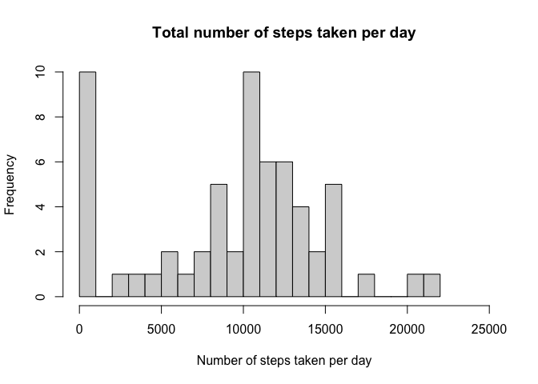
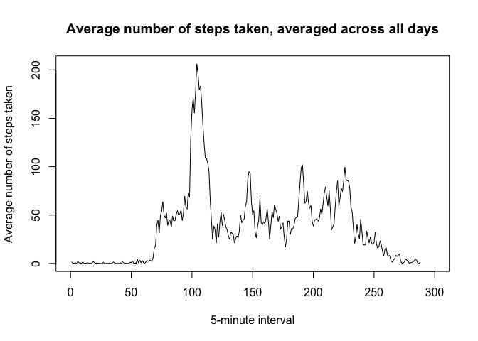
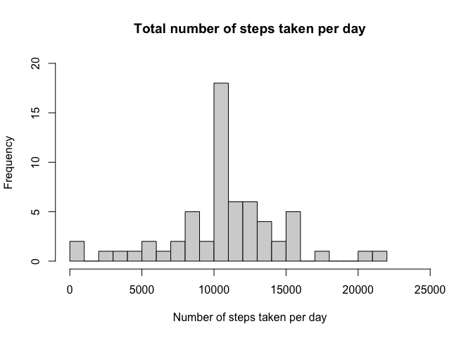
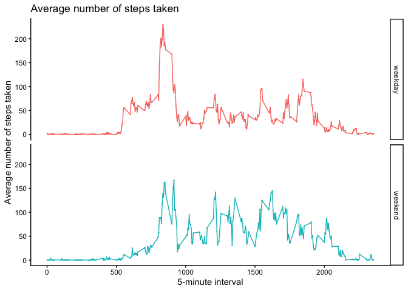

## Loading and preprocessing the data

``` r
# Read the dataset
data_activity <- read.csv("activity.csv")

# Summary of variables
summary(data_activity)
```

```
##      steps            date              interval     
##  Min.   :  0.00   Length:17568       Min.   :   0.0  
##  1st Qu.:  0.00   Class :character   1st Qu.: 588.8  
##  Median :  0.00   Mode  :character   Median :1177.5  
##  Mean   : 37.38                      Mean   :1177.5  
##  3rd Qu.: 12.00                      3rd Qu.:1766.2  
##  Max.   :806.00                      Max.   :2355.0  
##  NA's   :2304
```

``` r
# Convert from character to calendar date
data_activity$date <- as.Date(data_activity$date)
```

## What is mean total number of steps taken per day?

``` r
total_steps <- aggregate(steps ~ date, data = data_activity, sum, na.rm = TRUE)
```


``` r
# Histogram of the total number of steps taken each day
hist(total_steps$steps, breaks = 20, 
     xlim = c(0, 25000), xlab = "Number of steps taken per day", 
     main = "Total number of steps taken per day")
```

<!-- -->


``` r
# Calculate and report the mean and median of the total number of steps taken per day
```

#### Mean total number of steps taken per day:

``` r
mean(total_steps$steps)
```

```
## [1] 10766.19
```

#### Median total number of steps taken per day:

``` r
median(total_steps$steps)
```

```
## [1] 10765
```

## What is the average daily activity pattern?


``` r
library(dplyr)
```

```
## 
## Attaching package: 'dplyr'
```

```
## The following objects are masked from 'package:stats':
## 
##     filter, lag
```

```
## The following objects are masked from 'package:base':
## 
##     intersect, setdiff, setequal, union
```

``` r
# Average steps taken by 5-minute interval, averaged across all days
interval_steps <- data_activity %>%
  group_by(interval) %>%
  summarise(mean_steps = mean(steps, na.rm = TRUE))
```


``` r
# Make a time series plot of the 5-minute interval (x-axis) and the average number of steps taken, averaged across all days (y-axis)
plot(
  interval_steps$mean_steps,
  type = "l",
  xlab = "5-minute interval", xlim = c(0, 300),
  ylab = "Average number of steps taken", 
  main = "Average number of steps taken, averaged across all days"
)
```

<!-- -->

#### Which 5-minute interval, on average across all the days in the dataset, contains the maximum number of steps?

``` r
interval_steps$interval[which.max(interval_steps$mean_steps)]
```

```
## [1] 835
```

## Imputing missing values


``` r
# Calculate and report the total number of missing values in the dataset 
# (i.e. the total number of rows with NAs)
```
#### Total number of missing values in the dataset (i.e. the total number of rows with NAs): 

``` r
sum(is.na(data_activity))
```

```
## [1] 2304
```


``` r
# Create a new dataset that is equal to the original dataset but with the missing data 
# filled in, by using the mean for that 5-minute interval to impute missing values
data_activity_imp <- data_activity %>%
  group_by(interval) %>%
  mutate(steps = ifelse(is.na(steps),
                 mean(steps, na.rm = TRUE),
                 steps)) %>%
ungroup()

# Total number of steps taken by date
summ_data_activity_imp <- data_activity_imp %>%
  group_by(date) %>%
  summarise(total_steps = sum(steps))
```


``` r
# Make a histogram of the total number of steps taken each day
hist(summ_data_activity_imp$total_steps, 
     xlim = c(0, 25000), xlab = "Number of steps taken per day", 
     ylim = c(0, 20), 
     breaks = 20, 
     main = "Total number of steps taken per day")
```

<!-- -->


``` r
# Calculate and report the mean and median total number of steps taken per day
```

#### Mean total number of steps taken per day: 

``` r
mean(summ_data_activity_imp$total_steps)
```

```
## [1] 10766.19
```

#### Median total number of steps taken per day: 

``` r
median(summ_data_activity_imp$total_steps)
```

```
## [1] 10766.19
```

#### Do these values differ from the estimates from the first part of the assignment? 
The estimates are very similar.

#### What is the impact of imputing missing data on the estimates of the total daily number of steps?
It helps to reduce bias from excluding cases with missing data.

## Are there differences in activity patterns between weekdays and weekends?


``` r
# Create a new factor variable in the dataset with two levels – 
# “weekday” and “weekend” indicating whether a given date is a weekday or weekend day.
data_activity_imp$week <- ifelse(
  weekdays(data_activity_imp$date) %in% c("Monday", "Tuesday", "Wednesday", "Thursday", "Friday"),
  "weekday",
  "weekend"
)

# Average number of steps taken, averaged across weekdays and weekend of the 5-min interval
summ_data_week_activity <- data_activity_imp %>%
  group_by(interval, week) %>%
  summarise(avg_steps = mean(steps)) %>%
ungroup()
```

```
## `summarise()` has grouped output by 'interval'. You can override using the
## `.groups` argument.
```


``` r
# panel plot containing a time series plot of the 5-minute interval (x-axis) and 
# the average number of steps taken, averaged across all weekdays or weekends (y-axis)

summ_data_week_activity$week <- as.factor(summ_data_week_activity$week)

library(ggplot2)
```

```
## Warning: package 'ggplot2' was built under R version 4.5.2
```

``` r
ggplot(data = summ_data_week_activity, 
       aes(interval, avg_steps, colour = week)) + 
  geom_line() + geom_point(size = 0) + theme_classic() + 
  labs(x = "5-minute interval", y = "Average number of steps taken", 
       title = "Average number of steps taken", colour = "Days") + 
  facet_wrap(~ week, ncol = 1) + theme(legend.position = "none")
```

<!-- -->
